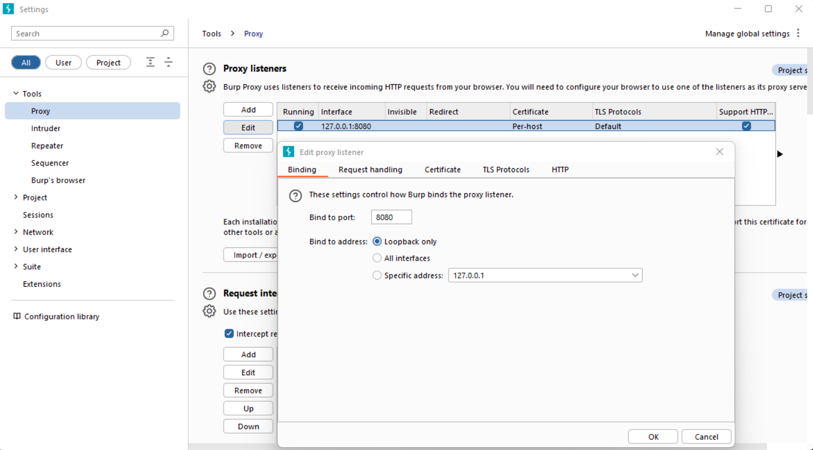
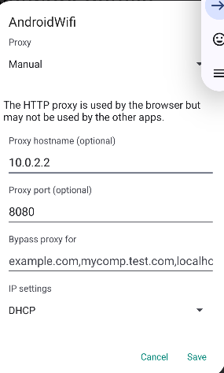
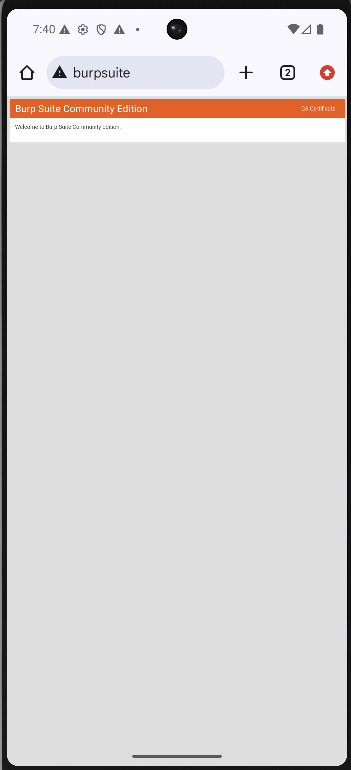
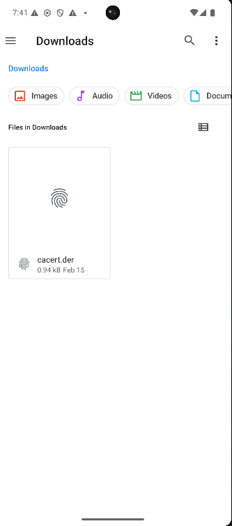
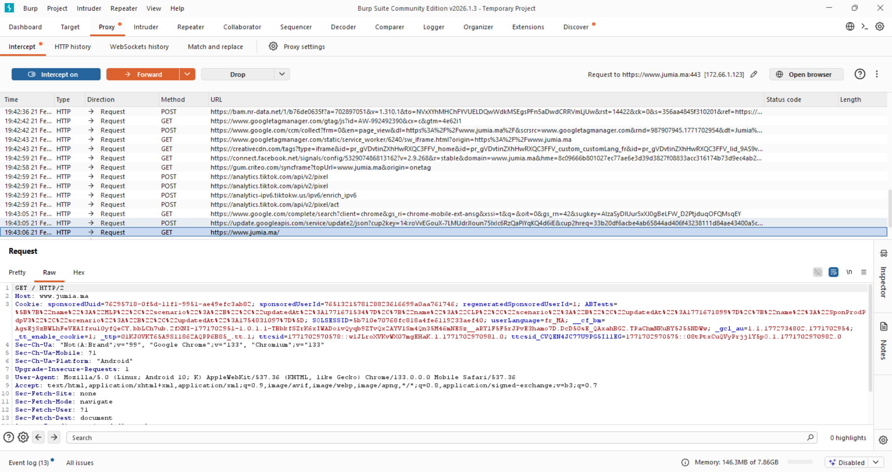

📱 Mobile Security Lab – Interception du trafic Android avec Burp Suite

🎯 Objectif

Ce laboratoire a pour objectif d’intercepter et d’analyser le trafic HTTP/HTTPS d’un téléphone Android à l’aide de Burp Suite Community Edition dans un environnement contrôlé.

Les mécanismes étudiés sont :

Fonctionnement d’un proxy interceptant

Analyse du trafic HTTP / HTTPS

Installation d’un certificat CA personnalisé

Inspection des requêtes et réponses

Analyse des cookies et tokens

Observation des trackers et appels API

⚠️ Tous les tests ont été réalisés en laboratoire autorisé uniquement.

1. Configuration de Burp Suite
Pourquoi ?

Burp Suite agit comme un proxy intermédiaire (Man-in-the-Middle contrôlé) entre le téléphone et Internet.

Il permet de :

Voir les requêtes envoyées

Modifier les requêtes

Analyser les réponses

Identifier les données sensibles

Configuration du Proxy Listener

Aller dans :

Proxy → Proxy Settings

Configurer :

Port : 8080

Bind to address :

Loopback only (émulateur)

All interfaces (téléphone réel)

Explication technique :

Burp écoute sur le port 8080 et intercepte tout trafic redirigé vers cette adresse.

2. Configuration du Proxy sur Android
Pourquoi ?

Le téléphone doit envoyer son trafic vers l’ordinateur exécutant Burp.

Aller dans :

Paramètres WiFi → Modifier le réseau → Proxy → Manuel

Configurer :

Proxy hostname : IP du PC (ex: 10.0.2.2 )

Proxy port : 8080

Analogie : c’est comme demander au téléphone de passer par un point de contrôle avant d’accéder à Internet.

3. Installation du certificat Burp (HTTPS)
Pourquoi ?

Le HTTPS chiffre le trafic.
Sans certificat CA installé, Android bloquera l’interception.

Téléchargement du certificat

Depuis le téléphone :

Naviguer vers :

http://burpsuite

Télécharger le certificat.

Installation du certificat

Ouvrir le fichier téléchargé (cacert.der) depuis Downloads.

Installer comme :

Certificat utilisateur (VPN et applications)

Concept de sécurité :

Un certificat CA permet de faire confiance à une autorité.
Ici, on ajoute Burp comme autorité de confiance locale.

4. Test d’interception

Ouvrir un site HTTPS depuis le téléphone.

Exemple :

5. Interception dans Burp

Activer :

Proxy → Intercept → Intercept is on

Les requêtes apparaissent dans :

Proxy → HTTP history

6. Analyse d’une requête interceptée

Dans l’onglet Raw, on peut observer :

Méthode HTTP (GET / POST)

Headers

Cookies

User-Agent

Tokens

Paramètres GET / POST

Exemple observé :

Cookies de session

Appels Google Analytics

Facebook tracking

TikTok analytics

Paramètres d’identification
